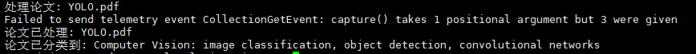
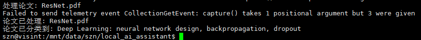
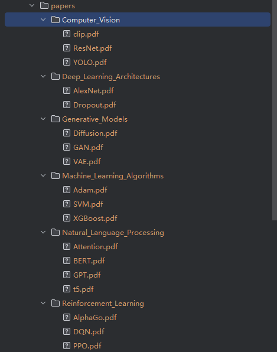
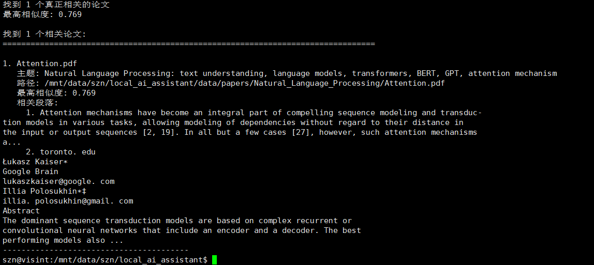
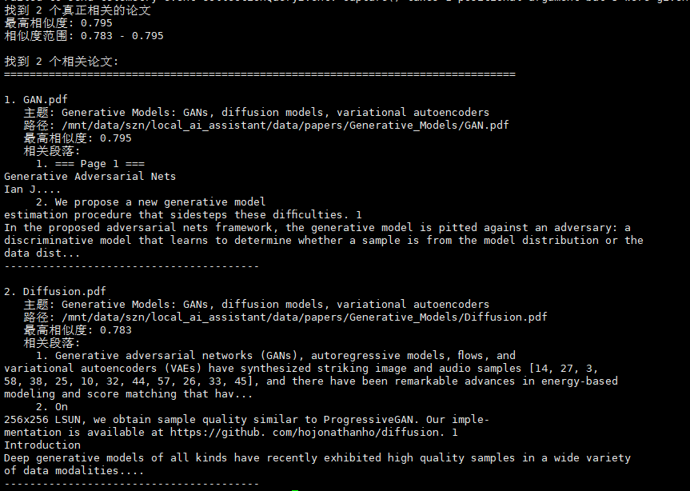
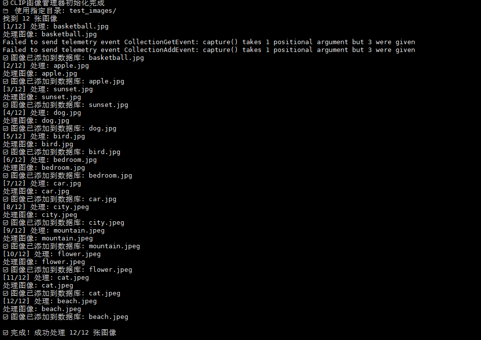
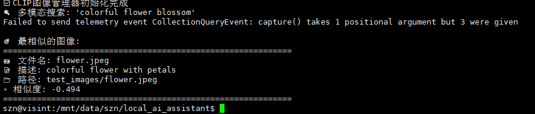
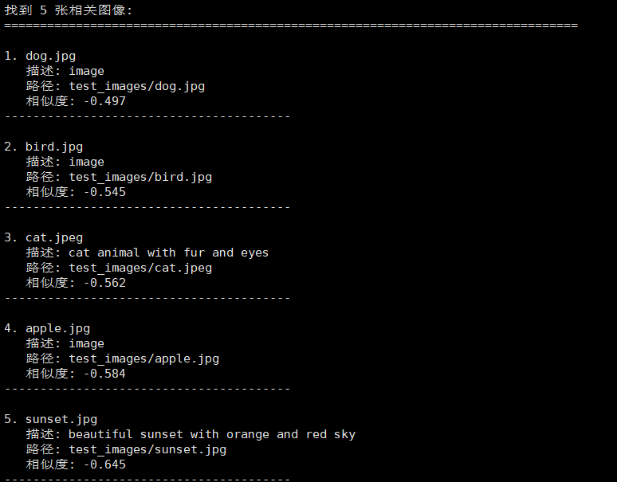

# 本地 AI 智能文献与图像管理助手

## 项目简介
本地 AI 智能文献与图像管理助手是一个基于 Python 的本地多模态 AI 智能助手，专为研究人员、学生和知识工作者设计，用于高效管理大量学术文献和图像素材。不同于传统的文件名搜索，本项目利用先进的多模态神经网络技术，实现基于内容的语义搜索和智能分类，让您能用自然语言快速定位所需资料。

项目完全在本地运行，保护数据隐私，无需网络连接。系统支持 GPU 加速，能够快速处理大量文档和图像。

## 核心功能

### 智能文献管理
1. **语义搜索论文**：使用自然语言提问（如"Transformer 的核心架构是什么？"），系统基于语义理解返回最相关的论文及相关段落
2. **自动分类整理**：
   - **单文件处理**：添加新论文时，根据内容自动归类到对应主题文件夹
   - **批量整理**：对混乱文件夹进行"一键整理"，自动扫描所有 PDF 并归档
3. **文件索引**：返回相关文件列表，方便快速定位所需文献

### 智能图像管理
1. **以文搜图**：通过自然语言描述查找本地图片（如"海边的日落"）
2. **多模态匹配**：基于 CLIP 模型实现图文跨模态检索
3. **批量处理**：自动扫描并索引整个图像目录

### 一键调用
通过命令行参数调用所有核心功能，支持批处理和自动化操作。

## 环境配置

### 系统要求
- **操作系统**：Linux / Windows / macOS
- **Python 版本**：Python 3.8 及以上
- **内存**：建议 8GB 及以上
- **GPU（可选）**：NVIDIA GPU（支持 CUDA）可大幅提升处理速度

### 依赖安装

```bash
# 1. 克隆项目
git clone <https://github.com/sunzhinuo/local-ai-assistant>
cd local_ai_assistant

# 2. 安装依赖
pip install -r requirements.txt

# 3. 检查安装
python main.py status
```

## 运行演示

### 系统运行截图
#### 1. 单篇论文分类效果
运行 `python main.py add_paper test_papers/YOLO.pdf --topics "Computer Vision"` 后，论文被自动分类到不同主题目录：



*图：论文被分类到指定主题目录*

运行 `python main.py add_paper test_papers/ResNet.pdf` 后，论文被自动分类到不同主题目录：


*图：论文被自动分类到相应的主题目录*

#### 2. 论文批量整理效果
运行 `python main.py organize_papers test_papers/` 后，论文被自动分类到不同主题目录：




*图：18篇论文被自动分类到6个主题目录*

#### 3. 语义搜索结果
运行 `python main.py search_paper "attention mechanism"` 的搜索结果：



*图：返回attention mechanism相关论文、相似度分数和内容片段，search_paper命令本身就返回文件索引*

运行 `python main.py search_paper "generative adversarial networks"` 的搜索结果：



*图：返回generative adversarial networks相关论文、相似度分数和内容片段，search_paper命令本身就返回文件索引*
#### 4. 以文搜图效果
运行 `python main.py process_images --dir test_images/` 进行图像处理：


运行 `python main.py search_image "sandy beach with ocean"` 找到最匹配的图像：


*图：基于自然语言描述找到海滩图像*

运行 `python main.py search_image "colorful flower blossom"` 找到最匹配的图像：


*图：基于自然语言描述找到花朵图像*

运行 `python main.py search_image "animal with fur and eyes" --show_all` 找到最匹配的图像：


*图：基于自然语言描述找到与动物相关的所有图像*
## 使用说明

### 项目结构
```
local_ai_assistant/
├── main.py              # 主程序入口
├── config.py            # 配置文件
├── text_manager.py      # 论文管理模块
├── image_manager_clip.py # 图像管理模块
├── utils.py             # 工具函数
├── requirements.txt     # 依赖列表
├── test_papers/         # 测试论文目录
├── test_images/         # 测试图像目录
└── data/               # 生成的数据目录
    ├── papers/         # 分类后的论文
    ├── images/         # 图像目录
    └── vector_db/      # 向量数据库
```

### 命令行使用示例

#### 1. 系统状态检查
```bash
python main.py status
```

#### 2. 论文管理

**批量整理论文**
```bash
# 清理数据库和目录
rm -rf data/vector_db
rm -rf data/papers/*

# 重新处理
python main.py organize_papers test_papers/

# 检查结果
ls -la data/papers/
```

**语义搜索论文**
```bash
# 基础搜索
python main.py search_paper "attention mechanism"

# 指定返回数量
python main.py search_paper "convolutional neural network" -n 3

# 更多示例
python main.py search_paper "generative adversarial networks"
python main.py search_paper "vision and language"
python main.py search_paper "transformer architecture"
```

**单文件处理**
```bash
python main.py add_paper test_papers/ResNet.pdf
python main.py add_paper test_papers/YOLO.pdf --topics "Computer Vision"

# 文件索引（返回最相关的1篇）
python main.py search_paper "convolutional neural network" -n 1
```

#### 3. 图像管理

**处理图像目录**
```bash
python main.py process_images --dir test_images/
```

**以文搜图**
```bash
# 水果类
python main.py search_image "fresh fruit apple"

# 自然景观
python main.py search_image "sandy beach with ocean"
python main.py search_image "mountain landscape"
python main.py search_image "orange sunset clouds"

# 室内场景
python main.py search_image "bedroom with bed"

# 动物
python main.py search_image "bird on branch"
python main.py search_image "cat animal pet"
python main.py search_image "dog animal pet"

# 城市景观
python main.py search_image "city skyline buildings"

# 植物
python main.py search_image "colorful flower blossom"

# 显示多个结果
python main.py search_image "animal with fur and eyes" --show_all
```

#### 4. 数据库统计
```bash
python main.py stats
```

### 完整工作流程示例
[](docs/videos/demo.mp4)
*完整演示视频存放路径在docs/videos/demo.mp4*
```bash
# 1. 初始化系统
python main.py status

# 2. 批量整理论文
python main.py organize_papers test_papers/

# 3. 建立图像索引
python main.py process_images --dir test_images/

# 4. 搜索测试
python main.py search_paper "deep learning"
python main.py search_image "nature landscape"

# 5. 添加新论文
python main.py add_paper new_paper.pdf
```

## 技术选型说明

### 文本处理模块
- **文本嵌入模型**：Sentence-BERT (all-MiniLM-L6-v2)
  - 轻量级文本嵌入模型，768维向量
  - 支持语义相似度计算
  - 本地部署，无需网络连接
- **PDF 解析**：PyMuPDF (fitz)
  - 高效提取 PDF 文本内容
  - 保留页面结构和格式信息
  - 支持中文等多种语言

### 图像处理模块
- **多模态模型**：CLIP (ViT-B/32)
  - OpenAI 开源的图文匹配模型
  - 512维图像和文本特征向量
  - 支持 GPU 加速推理
- **图像处理**：Pillow
  - 图像加载和预处理
  - 格式转换和调整

### 向量数据库
- **存储引擎**：ChromaDB
  - 轻量级向量数据库
  - 支持持久化存储
  - 余弦相似度搜索
  - 嵌入式设计，无需额外服务

### 深度学习框架
- **主框架**：PyTorch
  - 支持 GPU 加速
  - 模型加载和推理
- **模型管理**：HuggingFace Transformers
  - 模型下载和缓存
  - 标准化模型接口

## 配置文件说明

`config.py` 是系统的主要配置文件：

```python
# 路径配置
DATA_DIR = "data"                    # 数据存储目录
PAPERS_DIR = os.path.join(DATA_DIR, "papers")      # 分类后的论文目录
IMAGES_DIR = os.path.join(DATA_DIR, "images")      # 图像目录
VECTOR_DB_DIR = os.path.join(DATA_DIR, "vector_db") # 向量数据库目录

# 模型配置
TEXT_MODEL = "/mnt/data/szn/local_model"  # 文本嵌入模型路径
IMAGE_MODEL = "openai/clip-vit-base-patch32"  # CLIP 模型名称

# 分类主题（可自定义）
PAPER_TOPICS = [
    "Computer Vision: image classification, object detection, convolutional networks",
    "Natural Language Processing: text understanding, language models, transformers",
    "Reinforcement Learning: autonomous agents, game playing, policy optimization",
    "Machine Learning: optimization methods, gradient descent, statistical learning",
    "Deep Learning: neural network design, backpropagation, dropout",
    "Generative Models: GANs, diffusion models, variational autoencoders",
    "Multimodal Learning: vision-language models, audio-visual learning, CLIP"
]

# GPU 配置
DEVICE = "cuda:0" if torch.cuda.is_available() else "cpu"
```


---

**感谢使用本地 AI 智能文献与图像管理助手！**

